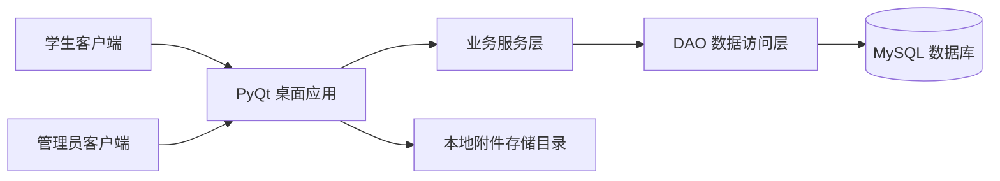

# ER 图与系统架构图

## ER 图

```mermaid
erDiagram
    MAJOR ||--o{ CLASS : contains
    MAJOR ||--o{ STUDENT : belongs_to
    CLASS ||--o{ STUDENT : groups
    STUDENT ||--o{ COURSE_SELECTION : selects
    COURSE ||--o{ COURSE_SELECTION : chosen_by
    COURSE_SELECTION ||--|| SCORE : has
    STUDENT ||--o{ REWARD_PUNISHMENT : owns
    STUDENT ||--o{ STUDENT_STATUS_CHANGE : owns
    STUDENT ||--o{ STUDENT_ATTACHMENT : owns

    MAJOR {
        int id PK
        varchar name
        varchar description
    }
    CLASS {
        int id PK
        varchar name
        int grade_year
        int major_id FK
    }
    STUDENT {
        int id PK
        varchar student_no
        varchar name
        varchar gender
        varchar phone
        varchar email
        int enrollment_year
        varchar status
        int major_id FK
        int class_id FK
    }
    COURSE {
        int id PK
        varchar course_code
        varchar name
        decimal credit
        int hours
        varchar semester
    }
    COURSE_SELECTION {
        int id PK
        int student_id FK
        int course_id FK
        date selection_date
    }
    SCORE {
        int id PK
        int selection_id FK
        decimal usual_score
        decimal final_score
        decimal total_score
        varchar grade_level
    }
```

## 系统总体架构图



