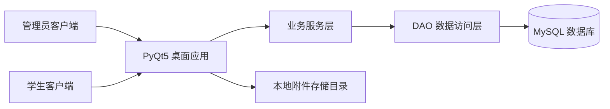
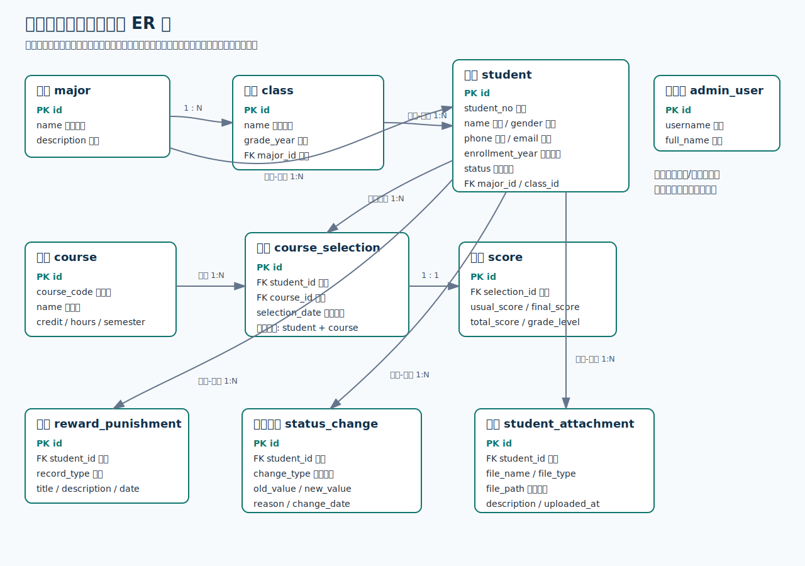

# 学籍管理系统需求分析说明与概要设计 ER 图

## 一、课题名称

学籍管理系统

## 二、课题背景

高校日常教务管理中，学生基本信息、专业班级、课程、选课、成绩、奖惩、学籍异动以及相关证明材料等数据较多，且各类数据之间存在紧密联系。如果仅依靠纸质材料或分散表格进行管理，容易出现信息重复、数据不一致、查询效率低、统计困难等问题。

因此，本课题设计并实现一个基于 `C/S` 架构的学籍管理系统，使用 `Python + PyQt5` 开发桌面客户端，使用 `MySQL` 作为后台数据库。系统通过图形界面完成数据录入和查询，通过数据库完成数据存储、约束维护和业务数据管理。

## 三、系统建设目标

本系统的目标是完成一个能够实际运行和演示的数据库应用系统，满足数据库课程设计对需求分析、概念结构设计、逻辑结构设计、系统实现和测试的要求。

主要目标如下：

1. 实现管理员和学生两类用户的登录与权限区分。
2. 实现学生档案、专业班级、课程、选课、成绩、奖惩、学籍异动和附件等信息的统一管理。
3. 使用 `MySQL` 设计结构合理、满足第三范式的数据表。
4. 在系统中体现图片、视频、普通文件等附件管理。
5. 为后续系统实现提供清晰的数据模型和模块划分依据。

## 四、用户角色分析

### 4.1 管理员

管理员是系统的主要维护者，负责对学籍相关数据进行管理。管理员可执行的操作包括：

1. 维护学生基本信息。
2. 维护专业和班级基础数据。
3. 维护课程信息。
4. 为学生建立选课记录。
5. 录入和修改学生成绩。
6. 登记学生奖惩记录。
7. 登记学生学籍异动记录。
8. 上传、查看和删除学生附件。
9. 查看系统统计概览。

### 4.2 学生

学生是系统的信息查询用户，主要用于查看本人相关信息。学生可执行的操作包括：

1. 查看个人基本档案。
2. 查看本人课程和成绩。
3. 查看本人奖惩记录。
4. 查看本人学籍异动记录。
5. 查看本人附件信息。

## 五、功能需求分析

### 5.1 登录功能

系统提供统一登录入口。用户登录时需要选择角色并输入账号和密码。系统根据角色分别查询管理员表或学生表，验证通过后进入对应主界面。

登录功能需要满足：

1. 支持管理员登录。
2. 支持学生登录。
3. 登录失败时给出提示。
4. 管理员和学生进入不同功能界面。

### 5.2 学生档案管理

学生档案是系统的核心业务数据。管理员可以对学生信息进行新增、修改、删除和查询。

学生档案主要包括：

1. 学号。
2. 姓名。
3. 性别。
4. 电话。
5. 邮箱。
6. 入学年份。
7. 学籍状态。
8. 所属专业。
9. 所属班级。

学生端只能查看本人档案信息，不能修改。

### 5.3 专业与班级管理

专业和班级是学生档案的基础分类信息。一个专业可以包含多个班级，一个班级属于一个专业。学生必须归属于一个专业和一个班级。

该模块用于支持学生分组、专业变更、班级变更和后续统计分析。

### 5.4 课程管理

管理员可维护课程信息，包括课程编号、课程名称、学分、学时和开课学期。课程信息用于选课和成绩管理。

课程管理需要保证课程编号唯一，避免同一课程重复录入。

### 5.5 选课管理

学生与课程之间是多对多关系，一个学生可以选择多门课程，一门课程也可以被多个学生选择。因此系统通过选课表记录学生与课程之间的关联关系。

选课管理需要满足：

1. 能够为学生添加选课记录。
2. 能够查询学生选课情况。
3. 防止同一学生重复选择同一课程。

### 5.6 成绩管理

成绩建立在选课记录基础之上。只有学生选课后，才能录入对应课程成绩。

成绩信息主要包括：

1. 平时分。
2. 期末分。
3. 总评成绩。
4. 成绩等级。
5. 最近更新时间。

管理员可录入和修改成绩，学生可查询本人课程成绩。

### 5.7 奖惩管理

管理员可登记学生奖励或惩罚记录。奖惩记录用于保存学生在校期间的表现情况。

奖惩记录主要包括：

1. 学生。
2. 记录类型。
3. 标题。
4. 说明。
5. 日期。

### 5.8 学籍异动管理

学籍异动用于记录学生专业、班级或学籍状态的变化。管理员登记异动时，需要保存异动记录，并同步更新学生档案中的对应字段。

学籍异动类型包括：

1. 专业变更。
2. 班级变更。
3. 状态变更。

学籍异动记录主要包括：

1. 学生。
2. 异动类型。
3. 原值。
4. 新值。
5. 异动原因。
6. 异动日期。

### 5.9 附件管理

课程设计要求系统中加入对图片、视频和文件的管理。因此本系统将附件管理挂接到学生档案下，用于保存学生证明材料、照片、视频说明或其他文档。

附件信息主要包括：

1. 所属学生。
2. 文件名。
3. 文件类型。
4. 文件路径。
5. 附件说明。
6. 上传时间。

系统采用“数据库保存文件路径，本地目录保存实际文件”的方式，避免将大文件直接保存到数据库中。

### 5.10 系统概览统计

管理员端提供基础统计信息，包括学生数量、课程数量、选课记录数量和附件数量，用于快速了解系统数据规模。

## 六、非功能需求分析

### 6.1 数据完整性要求

系统应通过主键、外键、唯一约束、枚举约束等方式保证数据完整性。例如学号和课程编号不能重复，学生所属专业和班级必须存在，选课记录必须关联真实学生和课程。

### 6.2 数据一致性要求

涉及多表联动的业务需要保证一致性。例如学籍异动登记时，系统既要保存异动历史，又要更新学生当前档案，不能出现只保存异动记录但学生档案未更新的情况。

### 6.3 易用性要求

系统界面应简洁清晰，适合课程设计展示。管理员能够通过表格和表单完成常见维护操作，学生能够方便地查询个人信息。

### 6.4 可维护性要求

系统代码应按界面层、业务层、数据访问层、数据库连接层进行划分，便于后续维护和扩展。

### 6.5 安全性要求

系统应区分管理员和学生权限。学生只能查看本人信息，不能进入管理员维护界面。用户密码不直接明文保存，而是保存密码散列值。

## 七、数据需求分析

根据功能需求，系统需要管理以下主要数据：

| 数据对象 | 说明 |
|---|---|
| 管理员 | 保存管理员登录账号和姓名 |
| 学生 | 保存学生基本档案和登录信息 |
| 专业 | 保存专业名称和说明 |
| 班级 | 保存班级名称、年级和所属专业 |
| 课程 | 保存课程编号、课程名称、学分、学时、学期 |
| 选课 | 保存学生和课程之间的选课关系 |
| 成绩 | 保存平时分、期末分、总评和等级 |
| 奖惩 | 保存学生奖励和惩罚记录 |
| 学籍异动 | 保存学生专业、班级、状态变化记录 |
| 附件 | 保存学生相关图片、视频、文件的元数据 |

## 八、概要设计

### 8.1 系统架构概要

本系统采用 `C/S` 架构。

客户端为 `Python + PyQt5` 桌面应用，负责用户登录、界面显示、表单录入和数据展示。服务端采用本地 `MySQL` 数据库，负责保存业务数据、维护数据完整性和执行数据库对象。

系统总体结构如下：

### 8.2 功能模块概要

系统主要分为以下模块：

1. 登录认证模块。
2. 管理员端业务维护模块。
3. 学生端信息查询模块。
4. 学生档案管理模块。
5. 课程与选课管理模块。
6. 成绩管理模块。
7. 奖惩管理模块。
8. 学籍异动管理模块。
9. 附件管理模块。
10. 数据库访问模块。

### 8.3 数据库实体概要

根据业务需求，系统抽象出以下主要实体：

1. 管理员 `admin_user`。
2. 学生 `student`。
3. 专业 `major`。
4. 班级 `class`。
5. 课程 `course`。
6. 选课 `course_selection`。
7. 成绩 `score`。
8. 奖惩 `reward_punishment`。
9. 学籍异动 `student_status_change`。
10. 附件 `student_attachment`。
11. 成绩审计日志 `score_audit_log`。

## 九、实体属性说明

### 9.1 管理员实体

管理员实体用于保存系统管理员登录信息。

主要属性：

| 属性 | 含义 |
|---|---|
| id | 管理员编号 |
| username | 登录账号 |
| password_hash | 密码散列值 |
| full_name | 管理员姓名 |

### 9.2 学生实体

学生实体用于保存学生基本档案。

主要属性：

| 属性 | 含义 |
|---|---|
| id | 学生编号 |
| student_no | 学号 |
| password_hash | 密码散列值 |
| name | 姓名 |
| gender | 性别 |
| phone | 电话 |
| email | 邮箱 |
| enrollment_year | 入学年份 |
| status | 学籍状态 |
| major_id | 所属专业 |
| class_id | 所属班级 |

### 9.3 专业实体

主要属性：

| 属性 | 含义 |
|---|---|
| id | 专业编号 |
| name | 专业名称 |
| description | 专业说明 |

### 9.4 班级实体

主要属性：

| 属性 | 含义 |
|---|---|
| id | 班级编号 |
| name | 班级名称 |
| grade_year | 年级 |
| major_id | 所属专业 |

### 9.5 课程实体

主要属性：

| 属性 | 含义 |
|---|---|
| id | 课程编号 |
| course_code | 课程号 |
| name | 课程名称 |
| credit | 学分 |
| hours | 学时 |
| semester | 开课学期 |

### 9.6 选课实体

主要属性：

| 属性 | 含义 |
|---|---|
| id | 选课编号 |
| student_id | 学生编号 |
| course_id | 课程编号 |
| selection_date | 选课日期 |

### 9.7 成绩实体

主要属性：

| 属性 | 含义 |
|---|---|
| id | 成绩编号 |
| selection_id | 选课编号 |
| usual_score | 平时分 |
| final_score | 期末分 |
| total_score | 总评 |
| grade_level | 等级 |
| last_updated | 最近更新时间 |

### 9.8 奖惩实体

主要属性：

| 属性 | 含义 |
|---|---|
| id | 奖惩编号 |
| student_id | 学生编号 |
| record_type | 奖惩类型 |
| title | 标题 |
| description | 说明 |
| record_date | 日期 |

### 9.9 学籍异动实体

主要属性：

| 属性 | 含义 |
|---|---|
| id | 异动编号 |
| student_id | 学生编号 |
| change_type | 异动类型 |
| old_value | 原值 |
| new_value | 新值 |
| change_reason | 异动原因 |
| change_date | 异动日期 |

### 9.10 附件实体

主要属性：

| 属性 | 含义 |
|---|---|
| id | 附件编号 |
| student_id | 学生编号 |
| file_name | 文件名 |
| file_type | 文件类型 |
| file_path | 文件路径 |
| description | 附件说明 |
| uploaded_at | 上传时间 |

## 十、实体关系说明

系统主要实体关系如下：

1. 一个专业可以包含多个班级，一个班级只属于一个专业。
2. 一个专业可以包含多个学生，一个学生只属于一个专业。
3. 一个班级可以包含多个学生，一个学生只属于一个班级。
4. 一个学生可以选择多门课程，一门课程可以被多个学生选择，学生与课程之间通过选课实体建立多对多关系。
5. 一条选课记录最多对应一条成绩记录。
6. 一个学生可以拥有多条奖惩记录。
7. 一个学生可以拥有多条学籍异动记录。
8. 一个学生可以拥有多个附件。

## 十一、概要设计 ER 图

## 十二、关系模式设计

根据 ER 图，可转换得到以下关系模式：

1. `admin_user(id, username, password_hash, full_name)`
2. `major(id, name, description)`
3. `class(id, name, grade_year, major_id)`
4. `student(id, student_no, password_hash, name, gender, phone, email, enrollment_year, status, major_id, class_id)`
5. `course(id, course_code, name, credit, hours, semester)`
6. `course_selection(id, student_id, course_id, selection_date)`
7. `score(id, selection_id, usual_score, final_score, total_score, grade_level, last_updated)`
8. `reward_punishment(id, student_id, record_type, title, description, record_date)`
9. `student_status_change(id, student_id, change_type, old_value, new_value, change_reason, change_date)`
10. `student_attachment(id, student_id, file_name, file_type, file_path, description, uploaded_at)`
11. `score_audit_log(id, selection_id, old_total_score, new_total_score, changed_at, note)`

## 十三、规范化说明

本系统关系模式设计满足第三范式，主要体现在：

1. 每张表均设置主键，记录可以唯一标识。
2. 学生、专业、班级、课程、成绩、奖惩、异动和附件等数据分别存放在独立表中，避免大量重复字段。
3. 选课表用于处理学生和课程之间的多对多关系，避免在学生表或课程表中保存重复课程信息。
4. 成绩表依赖选课记录，而不是直接重复保存学生和课程的完整信息。
5. 附件表只保存附件元数据和路径，不将附件内容混入学生主表。

通过以上设计，可以减少数据冗余，避免插入异常、删除异常和更新异常，提高系统数据的一致性和可维护性。
